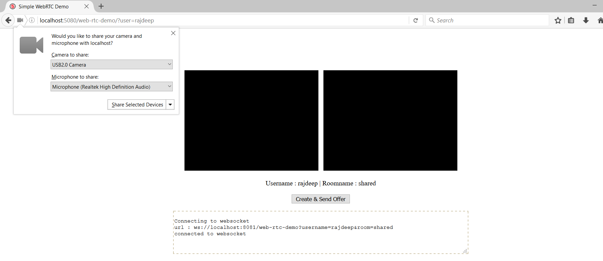

# Simple Red5 signaled WebRTC Demo (CLIENT AND SERVER)

 |  | 

### Introduction

This application sample demosntrates a simple one to one web-rtc audio / video chat, while using Red5 as its signaling backbone. While  red5 has always been the champion of open source streaming, the inclusion of websockets makes it an efficient open source candidate for realtime communication in the modern web structure.

In this example app we see how Red5 websocket helps in managing sinple chat rooms that mediate web-rtc sessions between html/js clients.


### Server side application (web-rtc-demo)

The red5 web-rtc-demo application is a websocket host, which allws you to connect to it via standard HTML5 websocket connections. The application lsitens on the default red5 websocket port **8081**, so your server needs to allow access to this port if its being accessed from outside. This means that the localhost and port must be configured in the red5/conf/jee-container.xml file.

```
<bean id="webSocketTransport" class="org.red5.net.websocket.WebSocketTransport">
    <property name="addresses">
        <list>
            <value>localhost:8081</value>
        </list>
    </property>
</bean>

```

>> This is not required if you are testing things locally.


#### FEATURES

* Allows only 2 users per room
* Requires parameters **username** and **room** to be provided via websocket url in query string
* Rooms are destroyed once all users are disconnected
* Intelligently sends sender information to receiever ina  room
* Allows sending arbitrary messages


The client application connects to the red5 websocket application using the following endpoint format: 

```
var url = "ws://localhost:8081/web-rtc-demo?username="+$user+"&room="+$room;
```

#### BUILDING THE SERVER APP


You can build the application usign maven.

```
mvn clean package
```

Deploy your application by copying the war file into your red5/webapps directory.

After deploy is complete, restart red5 and go to http://localhost:5080/web-rtc-demo/?user=<username> in your browser 


>> The application accepts connections with a username and a room parameter which are supplied via query string of the WebSocket url. User name must be unique for each connection.


<br>
---
<br>

### Client side application (index.html)


The client side application is a simple WebRTC sample built using javascript and WebRTC api. No third party libraries are used other than Jquery. The client application connects to Red5 server app over websocket for signaling, through the page : 


```
http://localhost:5080/web-rtc-demo/?user=<username>

```

`username` parameter is mandatory and must be unique when you testing this in two different browser windows. The application code default to a room name `shared`. This can be edit in the index.html file.


```
var room = "shared";
```


>> The server side application allows only 2 users per room, so you cannot open more than 2 browser windows. After the second connection all other connections will be denied.


>> The application has been tested on chrome and firefox.


#### FEATURES

* Tested on Chrome and Firefox
* Requires parameters **username** via url in query string
* Rooms are destroyed once all users are disconnected
* Intelligently relays sender data to receiever in the same room
* Supports sending arbitrary messages


#### RUNNING THE CLIENT APP

* Open the url in browser #1
```
http://localhost:5080/web-rtc-demo/?user=user1

```

* Accept media permission request to allow acquition of MediaStream on browser #1

* Open the url in browser #2

```
http://localhost:5080/web-rtc-demo/?user=user2

```

* Accept media permission request to allow acquition of MediaStream browser #1

* Click "Create & Send Offer" on any one browser window to initialize communication

* The offer is sent to the other user in the room and it auto-accepted

* The other user client returns answer to the offerer

* Offerer handles the answer

* Session is live.


>> Watch the text area console for logging information

<br>


#### Application Window



